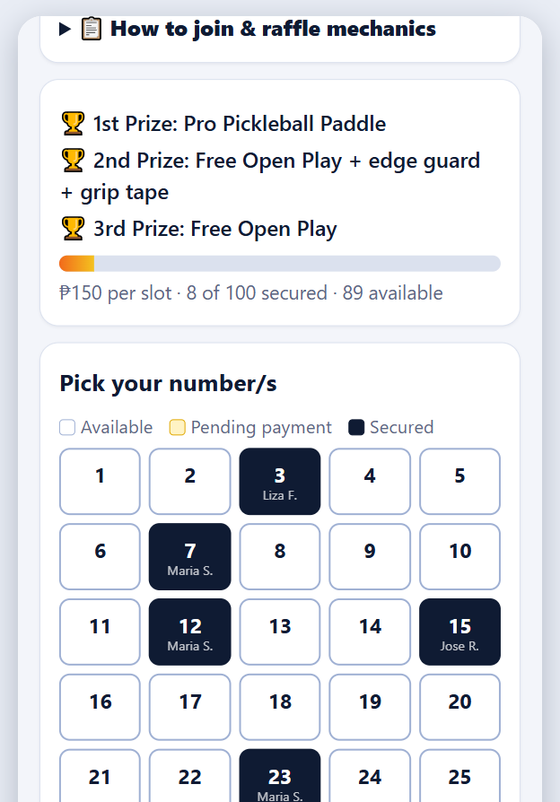
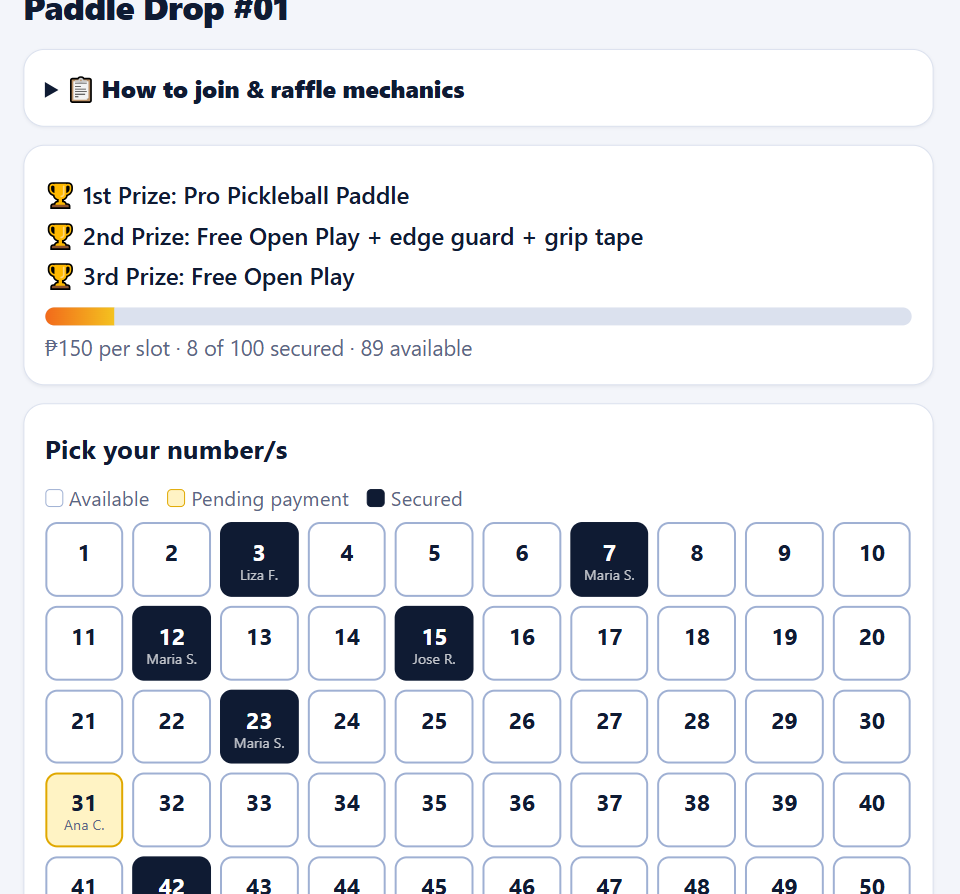
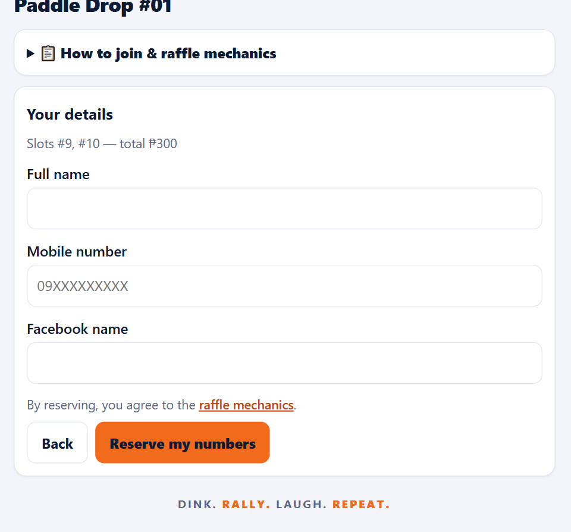
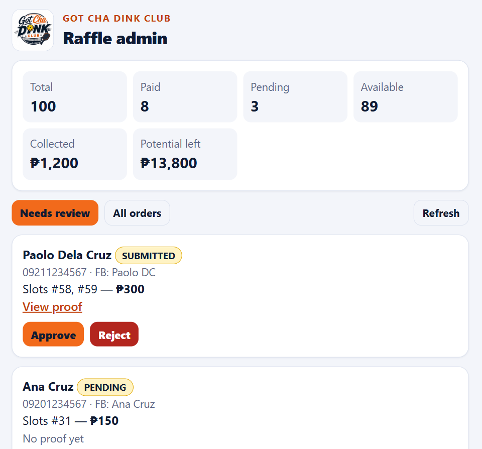

# Raffle slot form

**A live, mobile-first raffle app for Facebook sellers and clubs.** Customers pick numbers on a real-time
1–100 board, pay by GCash (QR or number), and upload a payment screenshot. The organiser approves
payments from a PIN-protected admin page, and approved numbers turn **Secured** on the public board.
No server, no monthly bill: a static site, Google Apps Script and a Google Sheet.

**Live:** https://raffleslotform.pages.dev — built for the Got Cha Dink Club paddle raffle.

| Phone | Board | Reserve | Admin |
|---|---|---|---|
|  |  |  |  |

*Screenshots use made-up customers; the live site shows real people only as "Maria S."*

```
AVAILABLE → PENDING (reserved, hold expires) → PAID (secured, after you approve)
```

## What it does
- **Live number board** that refreshes by itself, with Available / Pending / Secured states and a progress bar.
- **Reserve and pay:** pick up to 20 numbers, get a timed hold, pay by GCash QR or number, upload a screenshot
  (shrunk in the browser before upload).
- **Admin review:** approve, reject or release orders, view the proof, copy a "Payment confirmed" message to paste
  into Messenger. Every action shows its progress and result.
- **Raffle rules built in:** a "How to join & raffle mechanics" card and an agreement line on the form.
- **Draw tools:** freeze the paid entries, then draw prizes (the organiser can also run the draw elsewhere).
- **Privacy by design:** the public board shows "Maria S.", never mobile numbers or screenshots, and rejected or
  expired orders are deleted from the Sheet.

## How it works
```
Browser (static site on Cloudflare Pages)
   │  fetch (JSON)
   ▼
Google Apps Script web app ── script lock ──► Google Sheet  (Config · Orders · Slots)
   │                                           Google Drive  (private payment screenshots)
   └─ 20-second board cache + 5-minute keep-warm timer
```

## Engineering notes
Problems found in live testing, and how they were fixed:
- **Sheets quietly changed data.** An order ID made only of digits was stored as a number and never matched on
  lookup, and mobile numbers lost their leading 0. IDs now start with a letter, and name/mobile cells are written as text.
- **Lost responses on mobile data.** The server could finish a reservation while the browser never got the reply.
  Each attempt now carries a random token, so a retry returns the same order instead of a duplicate. The page recovers
  by itself, and after a refresh it offers a **Proceed to payment** button with a countdown.
- **Double booking.** Every write takes a script lock and rechecks the slot, so two people choosing #27 at once get
  one winner and one "just taken".
- **Slow cold starts.** Apps Script can take many seconds to wake. The board is cached for 20 seconds (cleared on any
  write), a timer pings the app every 5 minutes, and the browser has a 30-second timeout with a quiet retry.
- **Admin feedback.** Writes take a few seconds, so the admin page shows "Rejecting… / Rejected ✓" instead of
  appearing to do nothing.

**Stack:** vanilla JavaScript, HTML and CSS · Google Apps Script · Google Sheets and Drive · Cloudflare Pages.
**Cost: ₱0.**

```
web/        index.html (customers)  admin.html (you)  api.js  config.js  style.css
backend/    Code.gs  — paste into Apps Script
tests/      e2e.js   — browser test of the whole flow (offline preview)
docs/       screenshots used in this README
```

## Try it offline (optional preview, no setup)

With `API_URL` empty in `web/config.js`, the site runs against fake data stored in your own
browser instead of the live backend. The admin PIN in this offline preview is `1234`. The
published site sets `API_URL` to the Apps Script web app, so it is always live.

```bash
python3 -m http.server 8765 --directory web     # then open http://localhost:8765
```

## Go live, free (about 15 minutes)

### 1. Backend — Google Sheet + Apps Script
1. Create a new Google Sheet (name it e.g. "Raffle 001").
2. **Extensions → Apps Script.** Delete the sample code, paste all of `backend/Code.gs`, save.
3. Pick the `setup` function in the toolbar → **Run**. Approve the permissions prompt
   (it needs the Sheet and Drive). This creates the `Config`, `Slots` and `Orders` tabs,
   a private Drive folder for screenshots, and an admin PIN. Open **Execution log** to
   read the PIN, or set your own in **Project Settings → Script properties → `ADMIN_PIN`**.
4. Edit the **Config** tab: raffle name, prizes, price, total slots, hold minutes, and your
   payment instructions. (Change `totalSlots` *before* the raffle opens; re-run `setup`
   on a fresh sheet if you change it later.)
5. **Deploy → New deployment → Web app.** Execute as: **Me**. Who has access: **Anyone**.
   Deploy and copy the `…/exec` URL.

   > After any later edit to `Code.gs`, use **Deploy → Manage deployments → Edit → New version**,
   > otherwise the live URL keeps running the old code.
6. Optional but recommended: pick `installKeepWarm` in the function dropdown and **Run** it once (approve the
   permissions). It adds a 5-minute timer that pings the web app so visitors rarely hit a slow cold start.
   The board is also cached for 20 seconds; any reservation, approval or rejection refreshes it immediately.
   Run `installKeepWarm` **before** deploying a version that contains `keepWarm`, or the live URL will ask for
   authorization and fail until you do.

### 2. Front end — pick one free host
Put the contents of `web/` online and set `API_URL` in `web/config.js` to the URL from step 1.5 first.

| Host | How | Notes |
|---|---|---|
| **Cloudflare Pages** | Pages → Create project → Direct Upload → drag the `web` folder | Free, fast, no repo needed. Easiest. |
| **Netlify Drop** | drag the `web` folder onto app.netlify.com/drop | Free, 30 seconds. |
| **GitHub Pages** | Put `web/` contents in a repo (root or `/docs`), Settings → Pages → deploy from branch | Free; repo must be public on the free plan. |

Customer link: `https://your-site/` · Admin link: `https://your-site/admin.html` (PIN-protected; not linked anywhere).

Payment QR: the payment step shows `web/gcash-qr.jpg` above the text from the `paymentInstructions` Config cell.
Replace that image with your own QR (or delete it to hide the QR) and redeploy.

### 3. Run a raffle
1. Share the customer link in your Facebook group/page.
2. Open the admin page. **Needs review** lists each reservation with the proof link
   (opens in your Google Drive). **Approve** secures the slots; **Copy confirmation**
   gives you the "Payment confirmed 🎟️" message to paste into Messenger.
3. Unpaid holds expire by themselves after `holdMinutes` (no timer to run).
4. When sold out or on draw day: **Close & freeze final entries** (locks the paid list into
   a `FinalEntries` tab and rejects unpaid holds), then **Draw next prize** on the livestream.
   A slot that wins is excluded from later prizes (only that slot: a player with several slots can still win
   again, so apply a one-prize-per-person rule yourself if you need one). Winners are recorded in the `Draws` tab
   and shown on the public board.
5. Next raffle: copy the Sheet (File → Make a copy), re-run `setup` in the copy, deploy it as
   its own web app, and use a new `API_URL`. Keep each raffle's sheet as its record.

## What the system protects against
- **Double booking:** every write takes a script lock and rechecks the slot, so two people
  grabbing #27 at once get one winner and one "just taken" message.
- **Hoarding:** unpaid holds expire; one mobile number can have at most 3 open reservations.
- **Clean sheet:** expired, rejected and released orders free their slots and their row is deleted from the
  `Orders` tab (the payment screenshot stays in Drive). An expired hold can't be approved late; the customer picks again.
- **Privacy:** the public board shows only "Maria S."; mobile numbers and screenshots are admin-only,
  and screenshots are stored privately in your Drive (not public links).
- **Sheet injection:** name/FB/mobile columns are plain-text formatted so typed text can't run as a formula.

## Limits worth knowing
- Payment checking is still **manual by design** — you compare the screenshot with your wallet.
- The admin PIN is a simple shared secret, fine for one organiser; don't reuse a real password.
  The PIN is sent in the request body (not the URL). Wrong guesses are slowed down but not locked out, so use a
  long PIN (the generated 6 digits are the minimum).
- Apps Script adds about 1–2 seconds per request and is limited to roughly 30 concurrent
  executions; a 100-slot raffle is nowhere near that.
- The draw uses `Math.random()` on the frozen list, which is fine for a livestreamed club
  raffle, but it is not audited randomness. Showing the frozen list on stream first is what
  makes it credible.
- The board polls every 20 s; a customer sees "just taken" at submit time, never a double booking.

## Security notes
- **Data it touches:** each buyer's name, mobile number, Facebook name and payment screenshot. They live in your Google Sheet and a private Drive folder, so share both only with the organizers.
- **What is public on purpose:** the customer page, the backend URL it calls, and the payment QR. Customers need all three. The public board shows only "Maria S.", and the e2e test checks that no mobile number appears on it.
- **Who can call the backend:** anyone with the URL can use the public actions (view the board, reserve, upload proof). Holds expire by themselves and one mobile number can have at most 3 open reservations, but someone using many different numbers could tie up slots until their holds expire.
- **Admin access:** one shared PIN. Wrong guesses are refused before the script lock is taken, so guessing can't stall customers, but there is no lockout. Use a long PIN and change it for each raffle.
- **Payments:** verified by a person comparing the screenshot with the wallet. Nothing is auto-approved.
- **Before each raffle:** change the PIN, check the Sheet and Drive folder sharing, and make a copy of the Sheet when it ends as the record.

## Tests
The backend was tested by hand on the live site (reserve, upload, approve, reject, freeze, draw, lost-response
recovery). `tests/e2e.js` drives the real pages in Chromium (offline preview): reserve → race for the same slot → upload
proof → approve → public board → reject → freeze → three draws with no repeat winner. It was re-run against the current
front end (22 checks pass). It is safe to run against the shipped `web/` folder: it swaps in an empty `API_URL` in the
browser and fails if anything tries to reach the live backend, so it can never create reservations on a real raffle.

`Code.gs` itself can only run inside Google, so the same rules are mirrored in the offline backend in `api.js` and
tested there. `tests/code-gs-lock.js` runs the real `Code.gs` with stubbed Apps Script services to check one thing the
mirror can't: a wrong admin PIN is refused *before* the script lock is taken, so guessing can't stall customers. Do one
live dry run (reserve, upload, approve) after deploying.

```bash
python3 -m http.server 8765 --directory web &
npm i playwright && node tests/e2e.js     # set CHROME=/path/to/chrome if needed
node tests/code-gs-lock.js
```
